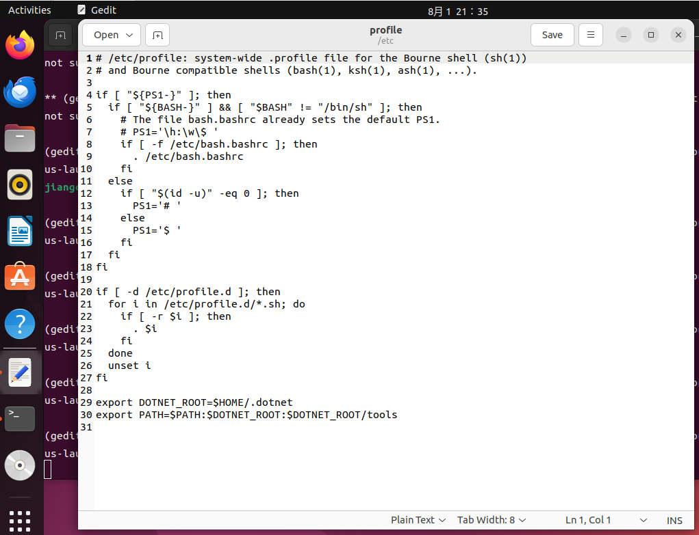
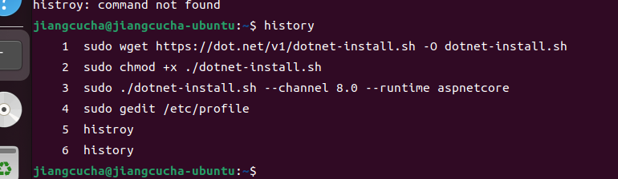

下载微软dotnet安装脚本
sudo wget https://dot.net/v1/dotnet-install.sh -O dotnet-install.sh

运行此脚本之前，请确保授予此脚本作为可执行文件运行的权限：
sudo chmod +x ./dotnet-install.sh

默认最新安装：sudo ./dotnet-install.sh --version latest

安装运行时（非SDK）：sudo ./dotnet-install.sh --version latest --runtime aspnetcore

制定版本安装：sudo ./dotnet-install.sh --channel 8.0

1.对所有用户生效要使环境变量对所有用户有效，可以修改profile文件：sudo vim /etc/profile

2.当前用户 ： sudo vim $HOME/profile

$HOME-- 一般就是路径 /home/用户名/ 
                        
原文链接：https://blog.csdn.net/rotion135/article/details/137132432

